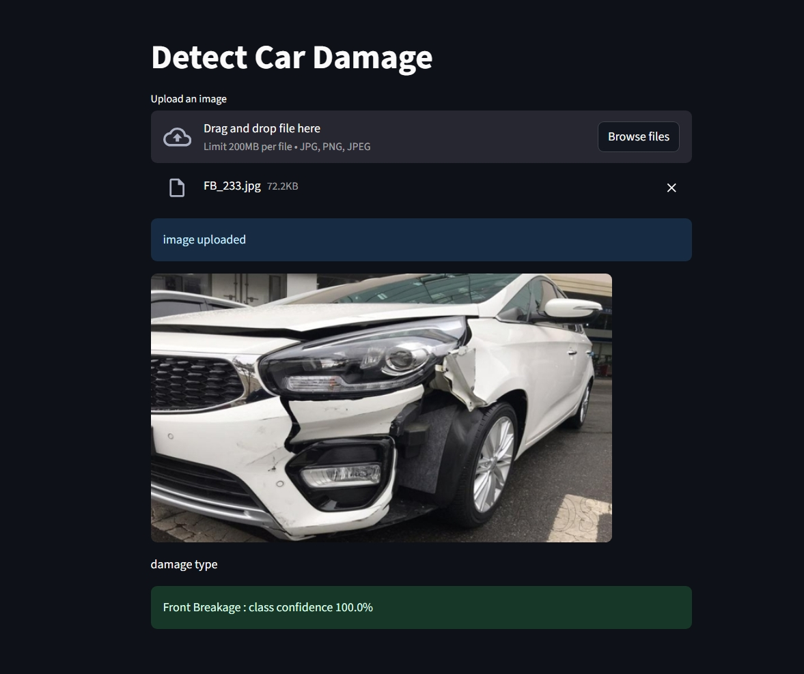

# 🚗 Detect Car Damage App

**AI-powered image classification for automotive damage assessment**  
Drag and drop a car photo and get an instant prediction of the damage type. This model is optimized for third-quarter front and rear views — for best results, upload images that capture those angles.

---

## 🏷️ Badges


[](https://share.streamlit.io/your-username/your-repo)


---

## 📸 Demo

  


---

## 🧠 Model Details

- **Base architecture**: ResNet50 (transfer learning)  
- **Training data**: ~1,700 labeled images  
- **Target classes (6)**:
  - Front Normal
  - Front Crushed
  - Front Breakage
  - Rear Normal
  - Rear Crushed
  - Rear Breakage
- **Validation accuracy**: ~80%

---

## ⚙️ Features

- Drag-and-drop image upload
- Real-time damage classification
- Clear class labels and confidence score
- Lightweight inference suitable for local deployment or small cloud instances

---

## 🚀 Quick Start
### 1. Install the dependencies:
     
```bash
  pip install -r requirements.txt
```
   
### 2. Run the streamlit app:
```bash
  streamlit run app.py
